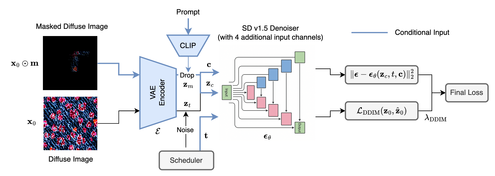

## Garment Texture Completion in UV space using Diffusion



We present a method for completing garment texture maps in UV space using a diffusion 
model conditioned on masked input and text prompts. Our approach focuses on 
predicting diffuse textures as a first step toward high-fidelity, 
physically based rendering (PBR) of garments. To train our model, we construct a synthetic 
dataset of 27,000 garment textures with corresponding PBR maps generated using the 
DressCode pipeline. We fine-tune a Stable Diffusion v1.5 model and systematically evaluate the impact of 
guidance scale, training strategy, and dataset size. 
Our findings show that image guidance plays a critical role, and surprisingly strong performance can be achieved even with a 
small subset of training data. The proposed method significantly outperforms non-finetuned baselines on 
LPIPS, SSIM, and PSNR metrics. We provide an in-depth analysis of failure cases and outline key directions for future work.

## Model and Data Download

We train all our model using synthetically generated data using [DressCode's](https://github.com/IHe-KaiI/DressCode) pretrained model. 
The dataset and the best model can be both downloaded from Hugging Face: 
- [dataset](https://huggingface.co/datasets/ludekcizinsky/garment-texture-completion)
- [model](https://huggingface.co/ludekcizinsky/garment-completion)


## Setup

In order to run the code, you need to create a virtual environment and install the dependencies with the following command:

```bash
conda create -n garment-diffusion python=3.10
conda activate garment-diffusion
pip install -r requirements.txt
```

## Training

You can train the model using the following command:

```bash
python train.py
```

Please see the configs/train.yaml for the training configuration and available options. To reproduce the experiments, please see [train.slurm](train.slurm).

## Evaluation

You can evaluate the model using the following command:

```bash
python eval_post_train.py
```

## Data Generation

To generate the data, you can use the following command:

```bash
python pbr_gen.py
```
